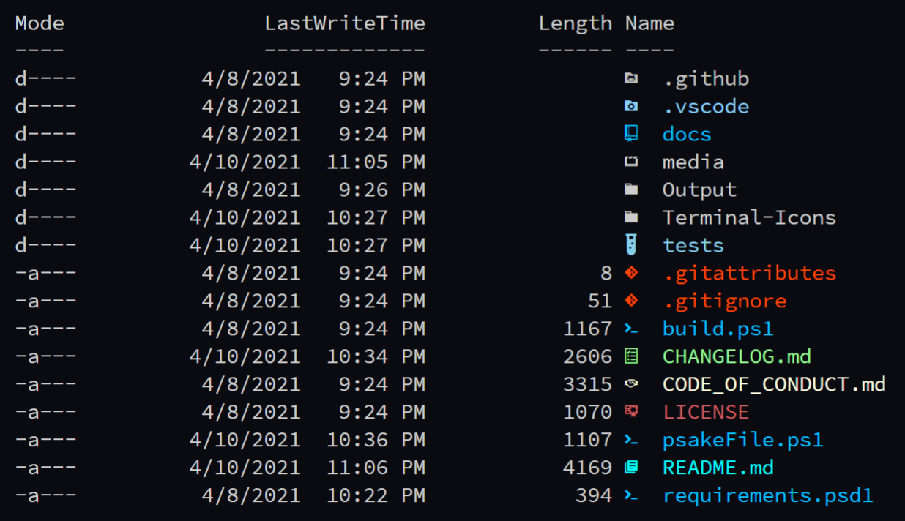
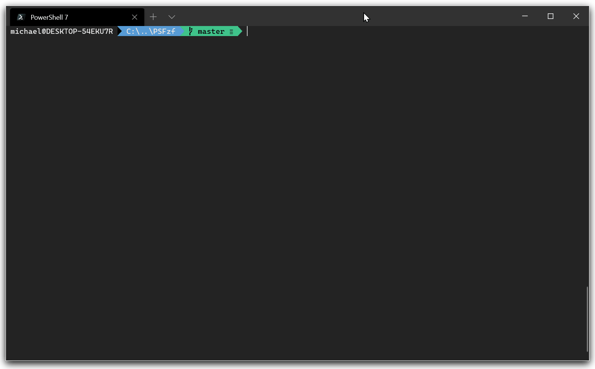
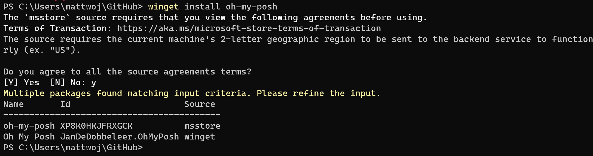

<p align='center'>
    <b>
        This is my repo for setting PowerShell Core 7 on Windows 10 & 11. Be careful when using my set ups.
    </b>
</p>

# Content 

<details> <summary>Table Of Contents</summary>

- [Content](#content)
- [Pre-Install](#pre-install)
  - [Install a NerdFont](#install-a-nerdfont)
- [Install PowerShell Modules](#install-powershell-modules)
  - [Terminal Icons](#terminal-icons)
    - [Overview](#overview)
    - [Installation](#installation)
    - [Usage](#usage)
    - [Screenshot](#screenshot)
  - [PSReadline](#psreadline)
    - [Overview](#overview-1)
    - [Installation](#installation-1)
    - [Usage](#usage-1)
  - [PSFzf](#psfzf)
    - [Prerequisites](#prerequisites)
    - [Installation](#installation-2)
    - [Usage](#usage-2)
  - [z](#z)
  - [Installation](#installation-3)
- [Intall Oh-my-posh](#intall-oh-my-posh)
  - [Choose and apply a PowerShell prompt theme](#choose-and-apply-a-powershell-prompt-theme)
- [Set Aliases](#set-aliases)
- [Create your custom themes](#create-your-custom-themes)

</details>

# Pre-Install

## Install a NerdFont

Customized command prompts often use glyphs (a graphic symbol) in order to style the prompt. If your font does not include the appropriate glyphs, you may see several Unicode replacement characters '▯' throughout your prompt. In order to see all of the glyphs in your terminal, we recommend installing a [Nerd Font](https://www.nerdfonts.com/font-downloads).

If you'd like a font that looks like Cascadia Code, the Caskaydia Cove Nerd Font was built from the Cascadia Code repository by a community member.)

After downloading, you will need to unzip and install the font on your system. ([How to add a new font to Windows](https://support.microsoft.com/en-us/office/add-a-font-b7c5f17c-4426-4b53-967f-455339c564c1)).

To set a Nerd Font for use with Oh My Posh and Terminal Icons, open the Windows Terminal settings UI by selecting Settings (Ctrl+,) from your Windows Terminal dropdown menu. Select the profile where you wish to apply the font, PowerShell for example, and then the Appearance tab. In the Font face drop-down menu, select CaskaydiaCove Nerd Font or whichever Nerd font you would like to use with your customized prompt.

# Install PowerShell Modules

## Terminal Icons

### Overview

Terminal-Icons is a PowerShell module that adds file and folder icons when displaying items in the terminal. This relies on the custom fonts provided by [Nerd Fonts](https://www.nerdfonts.com/).

> **Note**: You must be using one of the fonts provided by Nerd Fonts for this module to work as these fonts include tons of custom glyphs/icons that are referenced by their unicode number.

### Installation

To install the module from [PSGallery](https://www.powershellgallery.com/)

```pwsh
$ Install-Module -Name Terminal-Icons -Repository PSGallery
```

You can also install it from [Scoop](https://scoop.sh/)

```pswh
$ scoop bucket add extras
$ scoop install terminal-icons
```

### Usage

Add the following line to the PowerShell Core `$PROFILE`.

```pwsh
Import-Module -Name Terminal-Icons
```

### Screenshot



## PSReadline

### Overview

This module replaces the command line editing experience of PowerShell for versions 3 and up. It provides:

- Syntax coloring
- Simple syntax error notification
- A good multi-line experience (both editing and history)
- Customizable key bindings
- Cmd and emacs modes (neither are fully implemented yet, but both are usable)
- Many configuration options
- Bash style completion (optional in Cmd mode, - default in Emacs mode)
- Bash/zsh style interactive history search (CTRL-R)
- Emacs yank/kill ring
- PowerShell token based "word" movement and kill
- Undo/redo
- Automatic saving of history, including sharing history across live sessions
- "Menu" completion (somewhat like Intellisense, select completion with arrows) via Ctrl+Space

### Installation

To install the module from PSGallery, use this command on PowerShell Core

```pwsh
$ Install-Module -Name PSReadLine -RequiredVersion 2.1.0
```

> **Note**: The PSReadLine module contains cmdlets that let you customize the command-line editing environment in PowerShell.
> 
> There have been many updates to PSReadLine since the version that ships in Windows PowerShell 5.1.
>
> - PowerShell 7.3-preview.5 ships with PSReadLine 2.2.5
> - PowerShell 7.2.5 ships with PSReadLine 2.1.0
> - PowerShell 7.0.11 ships with PSReadLine 2.0.4
> - PowerShell 5.1 ships with PSReadLine 2.0.0

### Usage

To start using, just import the module:

```pwsh
Import-Module PSReadline
```

There are many configuration options, see the options to `Set-PSReadLineOption`. `PSReadLine` has help for it's cmdlets as well as an `about_PSReadLine` topic - see those topics for more detailed help.

To set your own custom keybindings, use the cmdlet Set-PSReadLineKeyHandler. For example, for a better history experience, try:

```pwsh
Set-PSReadLineKeyHandler -Key UpArrow -Function HistorySearchBackward
Set-PSReadLineKeyHandler -Key DownArrow -Function HistorySearchForward
```

With these bindings, up arrow/down arrow will work like PowerShell/cmd if the current command line is blank. If you've entered some text though, it will search the history for commands that start with the currently entered text.

To enable bash style completion without using Emacs mode, you can use:

```pwsh
Set-PSReadLineKeyHandler -Key Tab -Function Complete
```

To set prediction soure and prediction view style for PSReadline, you can use:

```pwsh
Set-PSReadLineOption -PredictionSource History
Set-PSReadLineOption -PredictionViewStyle InlineView
```

> __Note__: Sets the style for the display of the predictive text. The default is `InlineView`.
> 
> - `InlineView` - the style as existing today, similar as in `fish` shell and `zsh`. (default)
> - `ListView` - suggestions are rendered in a drop down list, and users can select using `UpArrow` and `DownArrow`.

## PSFzf

PSFzf is a PowerShell module that wraps `fzf`, a fuzzy file finder for the command line.



### Prerequisites

The latest version of `fzf` is available via [Chocolatey](https://chocolatey.org/packages/fzf), or you can download the fzf binary and place it in your path. Run `Get-Command fzf*.exe` to verify that PowerShell can find the executable.

PSFzf has been tested under PowerShell 5.0, 6.0, and 7.0.

### Installation

PSFzf is available on the [PowerShell Gallery](https://www.powershellgallery.com/packages/PSFzf) and [Scoop](https://github.com/ScoopInstaller/Extras/blob/master/bucket/psfzf.json). PSReadline should be imported before PSFzf as PSFzf registers PSReadline key handlers listed in the PSReadline integration section.

Install via PSGallery

```pwsh
$ Install-Module -Name PSFzf -RequiredVersion 2.4.9
```

Using Scoop to install PSFzf

```pwsh
$ scoop bucket add extras
$ scoop install psfzf
```

### Usage

Just import the module to the `$PROFILE` to start using it

```pwsh
Import-Module PSFzf
# Set Options
Set-PsFzfOption -PSReadlineChordProvider 'Ctrl+f' -PSReadlineChordReverseHistory 'Ctrl+r'
```

## z

_z_ lets you quickly navigate the file system in PowerShell based on your cd command history. It's a port of the z bash shell script

## Installation

```pwsh
$ Install-Module -Name z -RequiredVersion 1.1.9
```

# Intall Oh-my-posh 

To customize your PowerShell prompt, you can install Oh My Posh using winget. Enter the command

```pwsh
$ winget install oh-my-posh
```

Or you can install Oh-my-posh via `Install-Module` PowerShell command:

```pwsh
$ Install-Module -Name oh-my-posh
```

This will install:

- `oh-my-posh.exe`: The Windows executable
- `themes`: The latest [Oh My Posh themes](https://ohmyposh.dev/docs/themes)

You will need to agree to the source terms and may run into the instance that more than one package is available. In this case, select package ID that you wish to use and re-enter the command: `winget install <package ID>`.



To ensure you have the latest updates, you can use the following command: `winget upgrade oh-my-posh`.

## Choose and apply a PowerShell prompt theme

You may browse the full list of themes on the [Oh My Posh themes page](https://ohmyposh.dev/docs/themes).

Choose a theme and update your PowerShell profile with this command. (You can replace `notepad` with the text editor of your choice.)

```pwsh
$ notepad $PROFILE
```

Add the following to the end of your PowerShell profile file to set the `paradox` theme. (Replace paradox with the theme of your choice.)

```pwsh
oh-my-posh init pwsh --config "$env:POSH_THEMES_PATH\paradox.omp.json" | Invoke-Expression
```

Now, each new PowerShell instance will start by importing Oh My Posh and setting your command line theme.

# Set Aliases

PowerShell Core has many command aliases that can be listed using the `Get-Alias` command.

Here, I have set up some basic aliases for convenience and use them like Linux's commands

```pwsh
# set aliases
Set-Alias -Name touch -Value New-Item
Set-Alias -Name curl -Value Invoke-WebRequest
Set-Alias -Name ll -Value ls
Set-Alias -Name np -Value 'C:\WINDOWS\system32\notepad.exe'
Set-Alias -Name rn -Value Rename-Item
Set-Alias -Name which -Value where.exe
```

# Create your custom themes

I created 2 custom themes based on available oh-my-posh themes `agnoster.omp.json` and `zash.omp.json`. You can see how to create your custom themes on the [official website of Oh-my-posh](https://ohmyposh.dev/docs/themes).

To use the customized themes, make sure it was placed at the root directory of your computer `~` and add the command below to the `$PROFILE`

```pwsh
# You can replace agnoster.omp.json with any customized themes you want (if any)
oh-my-posh init pwsh --config "~\agnoster.omp.json" | Invoke-Expression
```